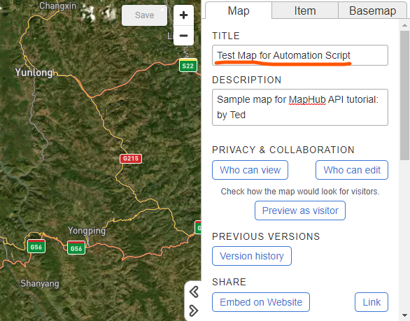

# MapHub Map Update Automation

This project requires Python 3.10+ and the following modules:
```
tqdm
pandas
geopandas
requests
```
Make sure you have installed the modules first in your Python environment.

# Setting Up Required Resources

## Create a New Map

1. Go to maphub.net and create a new map.
2. Give it a unique title. This can be changed later. Remember this title precisely. You will need this to get the Map ID later.

## Setup API Key

1. Go to maphub.net, login with a Business account (or another plan that gives API access)
2. Go to [MapHub API Key page](https://docs.maphub.net/api/index.html), and follow the instructions to get the API Key.
3. Create a new `config.py` file in `src/`. Open `src/config.py` and add the API key to MAPHUB_API_KEY. It should look like this: `MAPHUB_API_KEY = r'YOUR API KEY HERE'`.

## Get Map ID

1. Make sure you're in the project folder `maphub_automation`.
2. Open a terminal/PowerShell, run the Python script `src/GetMapID.py` by typing `python src/GetMapID.py`
3. You will be asked to enter the map title that you have given when you created a new map above. You can find the map title as shown in the image below, highlighted in orange:

4. Once the execution is complete, the script will print out the Map ID which is a 6 digit number.
5. Copy this number to `src/config.py` file. It should look like this: `MAPHUB_MAP_ID = r'YOUR MAP ID HERE'`. Note that this should be on its own new line since you will already have a line for `MAPHUB_API_KEY`.

## Set up Data Source

1. Make sure that your excel file is formatted the same way as `data/data.xlsx`. Check `column-descriptions` sheet in the same excel file for details.
2. Once it's formatted properly, replace `data/data.xlsx`. The main code will try to find this file to use as data source.

## Set up Images

1. If you wish to show images for each data point, save all images in the `img/` folder and change their names to the ID of the respective row in the `data/data.xlsx` file.
2. The code looks for `png`, `jpg` and `jpeg` files only. If you have other formats, convert to one of them first.
3. After running the script, you will see files with `json` extension. Leave them be.

## Set up Icons

1. If you wish to use custom icons, save all icons in `icons/` folder and populate `icon_name` column of `data/data.xlsx` with the file name of the icon file you wish to associate. 
2. Do NOT include extensions in the column.

## Set up Map Attributes

1. Open `src/config.py` file. You should already have 2 lines like this:
```python
MAPHUB_API_KEY = r'YOUR API KEY'
MAPHUB_MAP_ID = r'YOUR MAP ID'
```
2. Add these 3 new lines:
``` python
MAP_TITLE = r'YOUR MAP TITLE'
MAP_DESCRIPTION = '''YOUR MAP DESCRIPTION IN MARKDOWN'''
MAP_VISIBILITY = 'Public or Private'
```
3. For Map visibility, choose either `Public` or `Private`. 
4. Add the title and description, and save the file.

# Updating the Map

Now that you have done all the set up steps, (if you haven't go back to those) you can now update your map.
1. Open a terminal/PowerShell and navigate to `src/` folder.
2. Make sure you have activated the correct Python environment.
3. Run `python UpdateMap.py`.
4. If you have a lot of new images and icons, it will take a while to upload them to the MapHub server. You will see a progress bar.
5. When the code is ready to update the map, it will do the final confirmation. If you're sure, type `YES` in full caps and press enter.
6. Go to your map on the browser and refresh to see the updated map!
